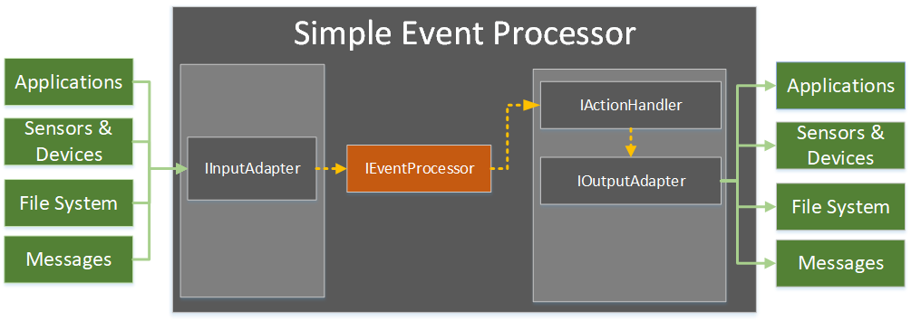

# AgileCode.SimpleEventProcessor

**AgileCode.SimpleEventProcessor** is a library, written for Microsoft.NET framework, which aim is to provide some fundamental **building blocks** (interfaces) in order to enable an easy event-processing.
By implementing the default (below specified) interfaces, one can build an application very quickly by only concentrating the efforts
to write the business logic of the application, and all of the event-passing plumbing is handled by the library.

The library is particularly suited for the microservice applications which need to process some event data in a synchronous 
or asyncronous fashion (i.e.: a queue listener, etc..).

This library is responsible for so called "Simple Events", which definition is (as taken from https://www.ibm.com/developerworks/library/ws-eventprocessing/index.html)

*Simple Event Processing*: Simple events; that is, events which do not summarize, represent or denote a set of other events, are filtered and routed without modification. 
Thus, a notable event happens, initiating downstream action(s), and each event occurrence is processed independently. 
Although referred to as 'simple', such events can provide great value and provide considerable business information. 
Events are transformed, which entails translating and splitting events, and merging one or more events. Simple processing includes processing 
such as changing the events schema from one form to another, augmenting the event payload with additional data, redirecting the event 
from one channel or stream to another, and generating multiple events based on the payload of a single event. 
This type of event processing is not always distinguished as a separate type.

## How does it work?

**AgileCode.SimpleEventProcessor** mainly offers four extension points.

* **IInputAdapter**: Extension point that enables the communication to the external source of events or data. 
Implementation of the IInputAdapter would typically include the interface to a Message Broker, Database (for pulling data out), Web Service, etc, so , 
to anything that can provide data (events, messages) that should be further processed. 
The idea is that this project supplies a set of basic InputAdapters so that those can be just plugged in and used straightforward. 
For the time being there are no particular implementations of it.
IInputAdatpter can be `started` or `stopped`, which makes it easy for the application to controll the flow.

* **IEventProcessor**: `EventProcessor` is de facto the broker for the messages received by the `InputAdapter`. For the time being there is only one implementation of the EventProcessor, the `QueuedEventProcessor` which enables the fully asynchronous processing of events.
`EventProcessor` is responsible for sending a message to the implementation of the `IActionHandler` and once this is done, to the `IOutputAdapter`.

* **IActionHandler**: By implementing this interface, we would typically implement the business logic of some kind. For instance, the transformation of the message we received as an input, etc. The result of this business logic will be passed to the `IOutputAdapter`.

* **IOutputAdapter**:  As its name says, it is responsible for communicating with an external resource. It might be a database, another Message Broker system, or simply a return message to the source (Acknowledgement).
